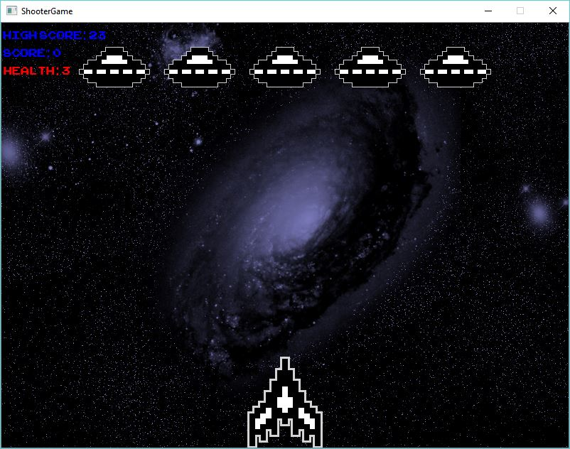
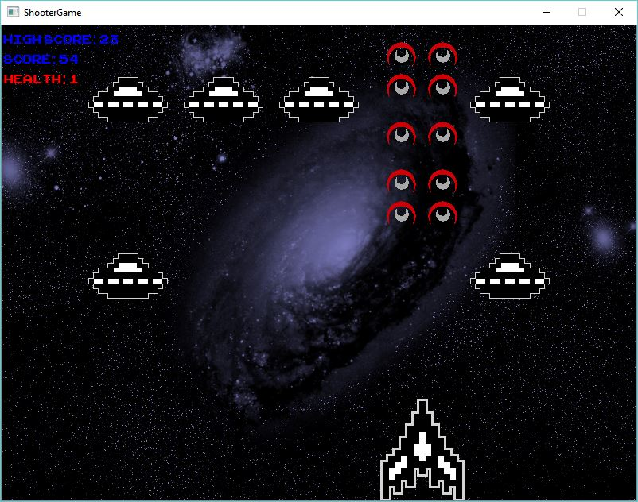
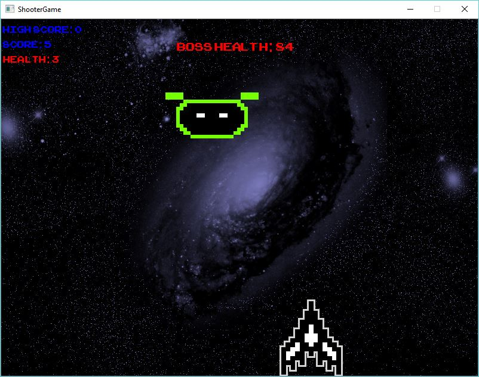
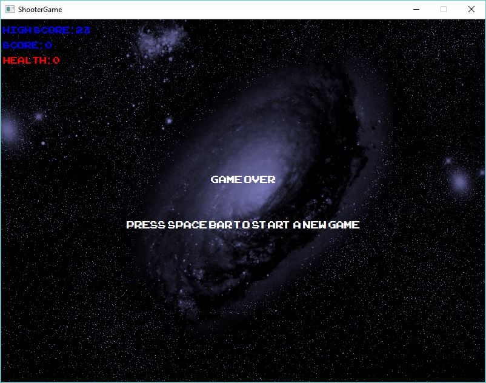

# Qt-Space-Shooter

## Qt Space Shooter Individual Project
**A retro space shooter game in C++ made with Qt Creator.**

Utilizes object-oriented programming to manage interactions between different elements of the game. Objects are created with the help of Qt libraries. A QGraphicsScene scene is populated by different QGraphicsItem objects to create our game window and encompasses the playing area.

#### Instructions ####
User controls a spaceship, moving with the left and right arrow keys and shooting with space bar. Enemies will continuously spawn in waves and the player must shoot them to increase their score. After every 5 waves, a boss will spawn in that the player must defeat to move on. If the player is hit by an enemy, they will lose 1 health and when their health reaches 0, the game ends. Pressing spacebar at the game over screen will restart the game.

#### Screenshots ####
 
**Start of the game. Enemies spawn in from the top.**

 
**Player has the power up so they shoot two shots at once.**

 
**Gameplay of the boss fight. Boss's health is displayed on screen and must be brought to 0.**

 
**Game Over Screen. Player can press space bar to start over.** 

